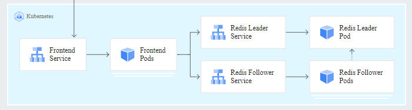

# nke-guestbook-demo
A containerized multi-tier web application using PHP & Redis, originally developed by Google as a [GKE demo app](https://cloud.google.com/kubernetes-engine/docs/tutorials/guestbook). (Also see the generic K8s (non-GKE) [user guide here](https://kubernetes.io/docs/tutorials/stateless-application/guestbook/))

The k8s deployment files of the demo app are customized to demonstratoe seamless integration with Nutanix Kubernetes Engine (NKE), by leveraging NKE platform capabilities such as out-of-the-box Container Storage Interface (CSI) and Container Network Interface (CNI) support. 
